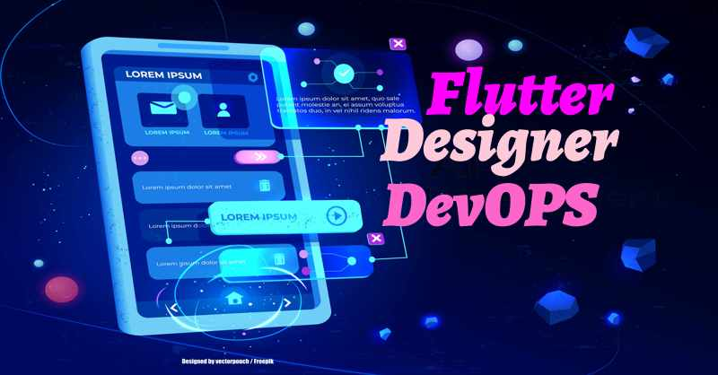

# Flutter Designer DevOPS

This is the designer fast prototyping project set up I am using to create all the demo flutter apps for my flutter app design book series, the paid Flutter UI kits I am creating etc. It features:

-Device Frame Previews
-Design Grid Previews For Custom Widgets
-Full Responsive And Adaptive Strategies
-Full DevOPS
-Storybook Isolation Tesing Of Custom Widgets
-EBay way of Goldens Testing
-BDD Testing
-Test Mocking with Mockito
-App Logging and App Exception capturing

Abuse and modify to your designer's heart desire. Articles on the techniques used can be found at:

[medium blog](https://fredgrott.medium.com)

I do post free friend links(free to access for non-medium members) to my articles on these social platforms, so it is helpful to join or follow:

[instagram](https://www.instagram.com/fredgrott/)

[linkedin](https://www.linkedin.com/in/fredgrottstartupfluttermobileappdesigner/)

[twitter](https://twitter.com/fredgrott)

